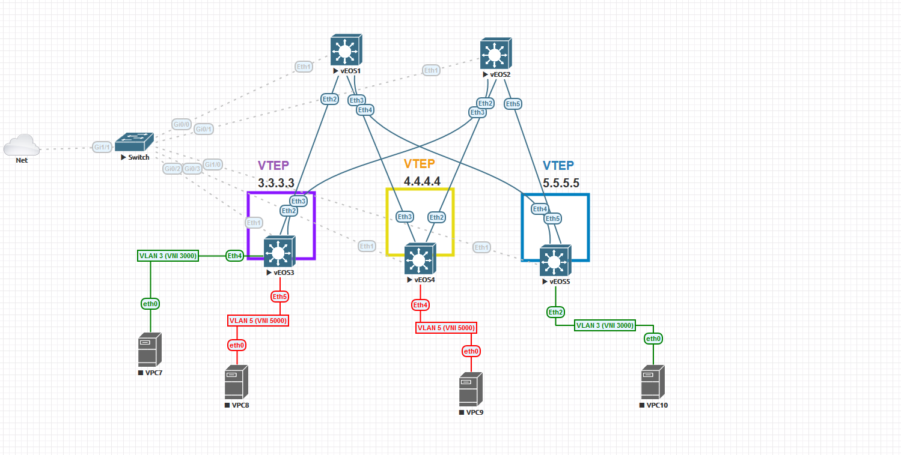

# VXLAN and ISIS Deployment

## VXLAN
Virtual Extensible LAN (VXLAN) is a networking technology that encapsulates MAC-based Layer 2 Ethernet frames within Layer 3 UDP packets to aggregate and tunnel multiple Layer 2 networks across a Layer 3 infrastructure. VXLAN scales up to 16 million logical networks and supports Layer 2 adjacency across IP networks. Multicast transmission architecture is used for broadcast, multicast, and unknown unicast traffic.

## IS-IS

The Intermediate System-to-Intermediate System (IS-IS) routing protocol is an Interior Gateway Protocol (IGP) standardized by the Internet Engineering Task Force (IETF) and commonly used in large Service Provider networks. IS-IS may also be deployed in extremely large Enterprise networks. IS-IS is a link-state routing protocol, providing fast convergence and excellent scalability. Like all link-state protocols, IS-IS is very efficient in its use of network bandwidth.

 
